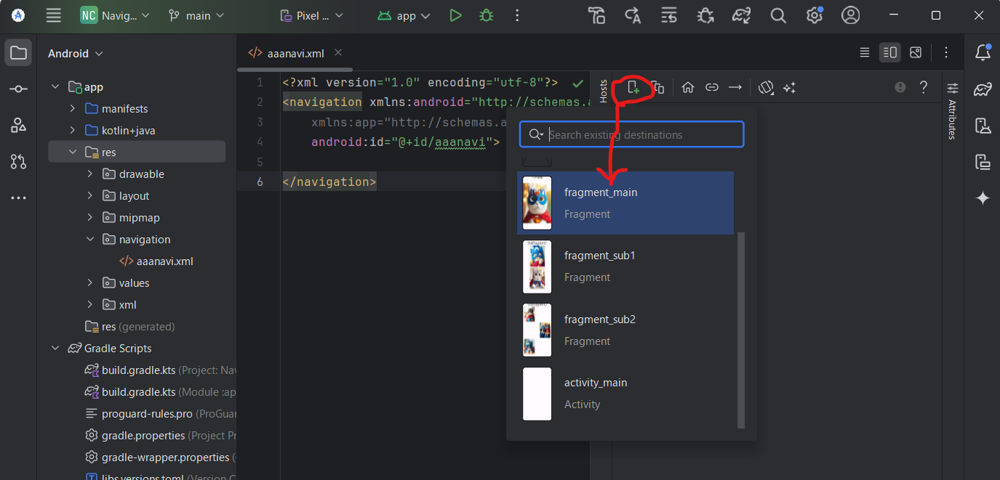
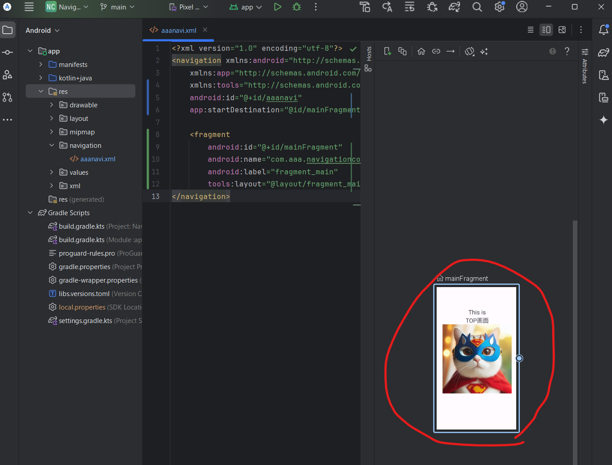
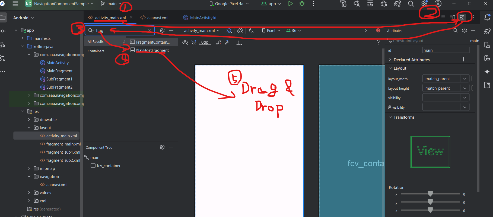
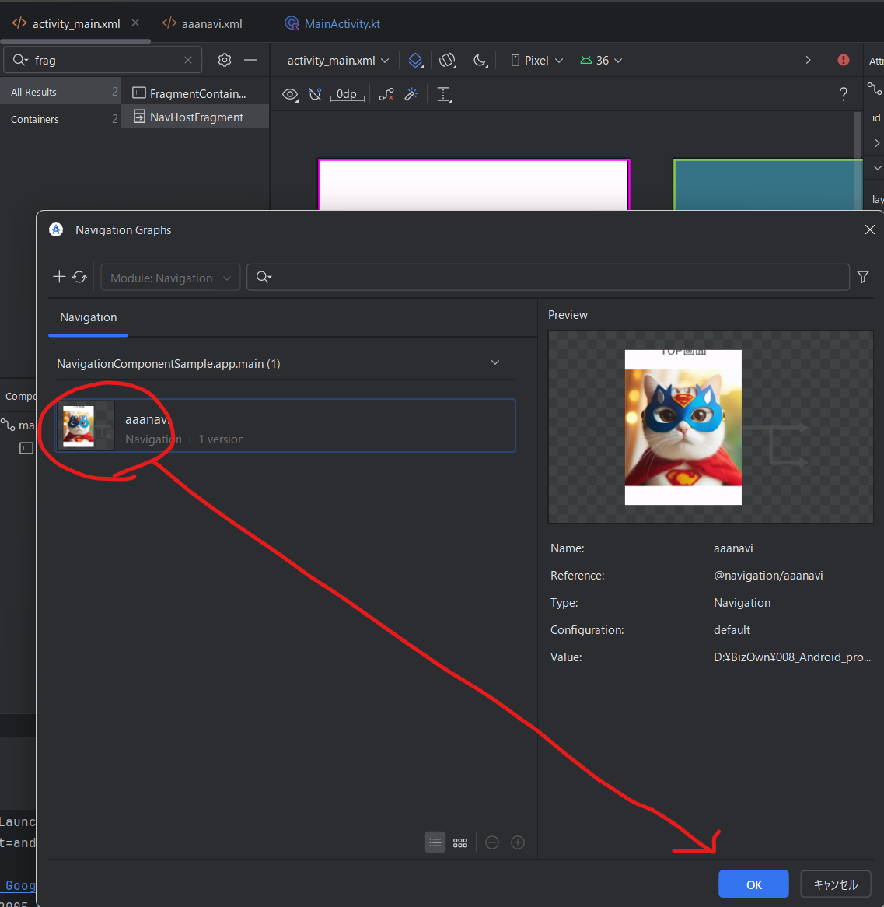

# AndKotlin-Navigation Component Sample
AndroidのNavigation Componentのサンプル

## Navigation Component
今の今まで Navigation Component を触らずにやってきたけど、いい加減士っとく必要があるかと思って調べてみた。  
早い話、ActivityとかFragmentとかの画面遷移をGUIで作れるようにしたやつ。実体はxmlファイルだけど、それをAndroid Studioで開くと図として表示してくれる。 状態遷移図が必要になりそうな時に Navigation Component で作っとくときっと幸せになれる。 必要になってからだもう遅い(いろいろ作り直しになると思われ)。

## ざっくり手順
1. Fragmentを準備
2. Navigationリソース(Resource Type = Navigation)を生成
3. Destination：デスティネーション(遷移先)を追加

## 1. Fragmentを準備
まぁ適当に。

## 2. Navigationリソース(Resource Type = Navigation)を生成
<br/>

  File name: aaanavi  
  Resource type: Navigation  
  後はデフォルトで


OK押下  
↓  
res\navigation配下にaaanaviが出来る。  
ダブルクリックで開いとく  


以下この操作での変更点  
1. res/navigation/aaanavi.xmlファイルを新規作成
2. build.gradle.ktsのdependenciesにimplを追加
3. libs.versions.tomlに定義を追加

- res/navigation/aaanavi.xmlファイルを新規作成
```diff xml:aaanavi.xml
+ <?xml version="1.0" encoding="utf-8"?>
+ <navigation xmlns:android="http://schemas.android.com/apk/res/android"
+     xmlns:app="http://schemas.android.com/apk/res-auto"
+     android:id="@+id/aaanavi">
+ 
+ </navigation>
```

- build.gradle.kts(45-46)のdependenciesにimplを追加
```diff kot:build.gradle.kts
+   implementation(libs.androidx.navigation.fragment.ktx)
+   implementation(libs.androidx.navigation.ui.ktx)
```

- libs.versions.toml(12-13,24-25)に定義を追加
```diff toml:libs.versions.toml
+ navigationFragmentKtx = "2.9.0"
+ navigationUiKtx = "2.9.0"

+ androidx-navigation-fragment-ktx = { group = "androidx.navigation", name = "navigation-fragment-ktx", version.ref = "navigationFragmentKtx" }
+ androidx-navigation-ui-ktx = { group = "androidx.navigation", name = "navigation-ui-ktx", version.ref = "navigationUiKtx" }
```

## 3. Destination：デスティネーション(遷移先)を追加
ActivityやらFragmentやらを遷移先に指定できる。  
※ちなみにこの操作してもまだ何も表示されない  

下図の赤丸アイコンを押下 → 遷移先を追加



<br/>↓ こうなった<br/>



この操作での変更点  
1. res/navigation/aaanavi.xmlファイルにfragmentの定義を追加

- res/navigation/aaanavi.xml(4,6,8-12)
```diff xml:aaanavi.xml
<navigation xmlns:android="http://schemas.android.com/apk/res/android"
    xmlns:app="http://schemas.android.com/apk/res-auto"
+   xmlns:tools="http://schemas.android.com/tools"
    android:id="@+id/aaanavi"
+   app:startDestination="@id/mainFragment">

+   <fragment
+       android:id="@+id/mainFragment"
+       android:name="com.aaa.navigationcomponent.MainFragment"
+       android:label="fragment_main"
+       tools:layout="@layout/fragment_main" />
```

## 4. ActivityにNavigation Componentをくっつける。

1. Activityに設定しているlayautファイル(activity_main.xml)を開く
2. Design画面を開いとく
3. frag と入力。 NavHostFragmentを検索
4. NavHostFragment を activity_main.xmlにDrag & Drop



<br/>↓<br/>
5. 出てきたpopupで手順3で設定したFragment(or Acivity)を選択 → OK



この操作での変更点  
1. activity_main.xmlファイルに FragmentContainerView を追加

- activity_main.xml(16-25)
```diff xml:activity_main.xml
<?xml version="1.0" encoding="utf-8"?>
<androidx.constraintlayout.widget.ConstraintLayout
    xmlns:android="http://schemas.android.com/apk/res/android"
    xmlns:app="http://schemas.android.com/apk/res-auto"
    xmlns:tools="http://schemas.android.com/tools"
    android:id="@+id/main"
    android:layout_width="match_parent"
    android:layout_height="match_parent"
    tools:context=".MainActivity">

    <androidx.fragment.app.FragmentContainerView
        android:id="@+id/fcv_container"
        android:layout_width="match_parent"
        android:layout_height="match_parent" />

+   <androidx.fragment.app.FragmentContainerView
+       android:id="@+id/fragmentContainerView"
+       android:name="androidx.navigation.fragment.NavHostFragment"
+       android:layout_width="170dp"
+       android:layout_height="8dp"
+       app:defaultNavHost="true"
+       app:navGraph="@navigation/aaanavi"
+       tools:layout_editor_absoluteX="1dp"
+       tools:layout_editor_absoluteY="182dp" />

</androidx.constraintlayout.widget.ConstraintLayout>
```

うーん、fragmentのコンテナとしてfcv_containerを準備してたのに、勝手に別のFragmentContainerViewを追加されてしまった。既存への追加の方法はわかんない。

手で修正する。

- activity_main.xml(13,16-17,19-25)
```diff xml:activity_main.xml
<?xml version="1.0" encoding="utf-8"?>
<androidx.constraintlayout.widget.ConstraintLayout
    xmlns:android="http://schemas.android.com/apk/res/android"
    xmlns:app="http://schemas.android.com/apk/res-auto"
    xmlns:tools="http://schemas.android.com/tools"
    android:id="@+id/main"
    android:layout_width="match_parent"
    android:layout_height="match_parent"
    tools:context=".MainActivity">

    <androidx.fragment.app.FragmentContainerView
        android:id="@+id/fcv_container"
+       android:name="androidx.navigation.fragment.NavHostFragment"
        android:layout_width="match_parent"
        android:layout_height="match_parent"
+       app:defaultNavHost="true"
+       app:navGraph="@navigation/aaanavi" />

-   <androidx.fragment.app.FragmentContainerView
-       android:id="@+id/fragmentContainerView"
-       android:name="androidx.navigation.fragment.NavHostFragment"
-       android:layout_width="170dp"
-       android:layout_height="8dp"
-       app:defaultNavHost="true"
-       app:navGraph="@navigation/aaanavi"
-       tools:layout_editor_absoluteX="1dp"
-       tools:layout_editor_absoluteY="182dp" />

</androidx.constraintlayout.widget.ConstraintLayout>
```

※この手修正をすると画面が表示される様になった。  

