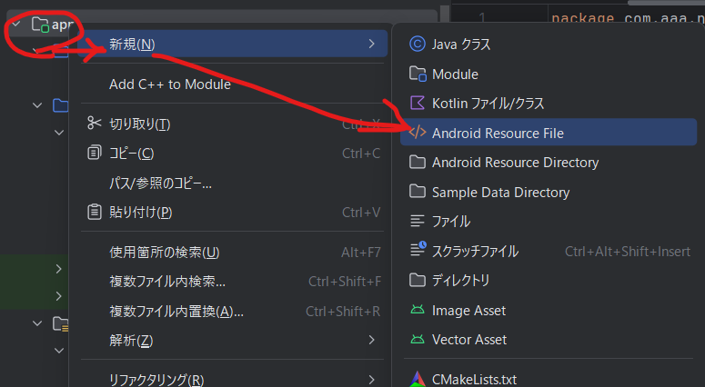
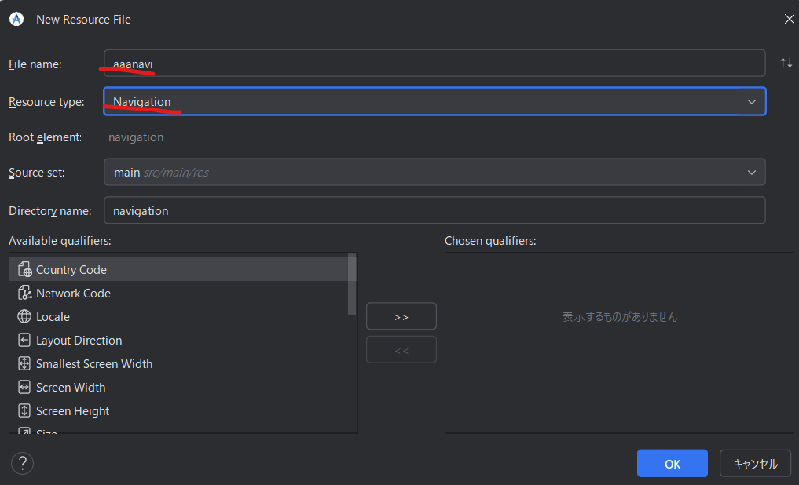
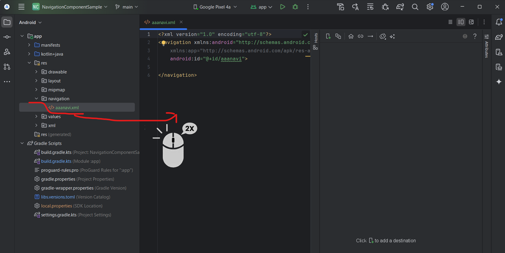

# AndKotlin-Navigation Component Sample
AndroidのNavigation Componentのサンプル

## Navigation Component
今の今まで Navigation Component を触らずにやってきたけど、いい加減士っとく必要があるかと思って調べてみた。  
早い話、ActivityとかFragmentとかの画面遷移をGUIで作れるようにしたやつ。実体はxmlファイルだけど、それをAndroid Studioで開くと図として表示してくれる。 状態遷移図が必要になりそうな時に Navigation Component で作っとくときっと幸せになれる。 必要になってからだもう遅い(いろいろ作り直しになると思われ)。

## ざっくり手順
1. Fragmentを準備
2. Navigationリソース(Resource Type = Navigation)を生成
3. 

## 1. Fragmentを準備
まぁ適当に。

## 2. Navigationリソース(Resource Type = Navigation)を生成
<br/>

  File name: aaanavi  
  Resource type: Navigation  
  後はデフォルトで



OK押下  
↓  
res\navigation配下にaaanaviが出来る。  
ダブルクリックで開いとく  


以下この操作での変更点
```diff xml:aaanavi.xml
+ <?xml version="1.0" encoding="utf-8"?>
+ <navigation xmlns:android="http://schemas.android.com/apk/res/android"
+     xmlns:app="http://schemas.android.com/apk/res-auto"
+     android:id="@+id/aaanavi">
+ 
+ </navigation>
```

```diff kot:build.gradle.kts
+   implementation(libs.androidx.navigation.fragment.ktx)
+   implementation(libs.androidx.navigation.ui.ktx)
```

```diff toml:libs.versions.toml
+ navigationFragmentKtx = "2.9.0"
+ navigationUiKtx = "2.9.0"

+ androidx-navigation-fragment-ktx = { group = "androidx.navigation", name = "navigation-fragment-ktx", version.ref = "navigationFragmentKtx" }
+ androidx-navigation-ui-ktx = { group = "androidx.navigation", name = "navigation-ui-ktx", version.ref = "navigationUiKtx" }
```


## 3. Destination：デスティネーション(遷移先)を追加
ActivityやらFragmentやらを遷移先に指定できる。

